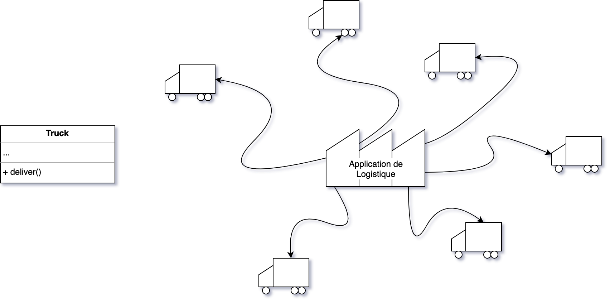
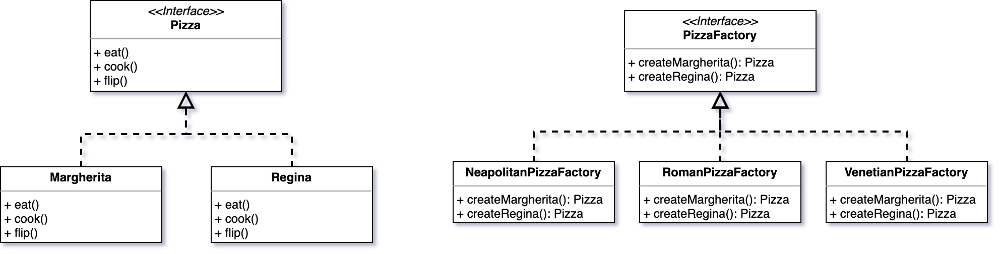
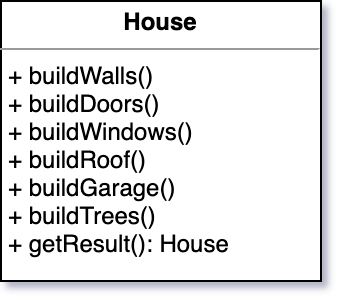
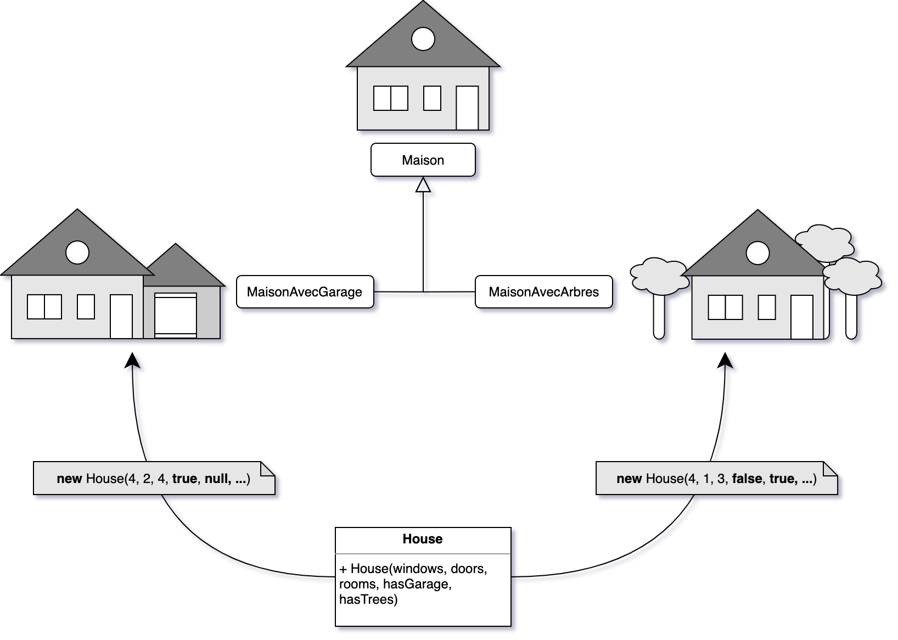
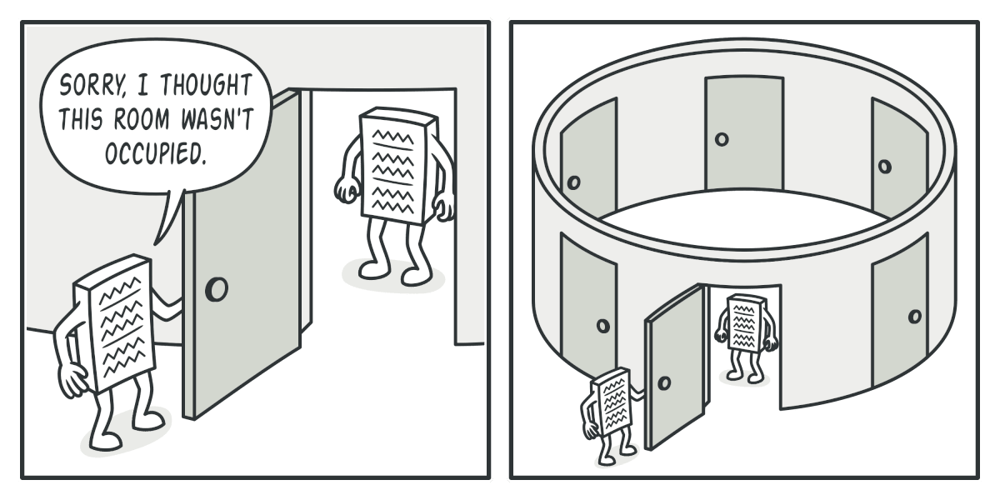
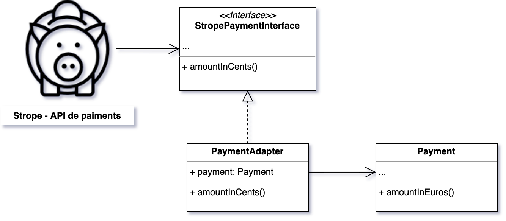
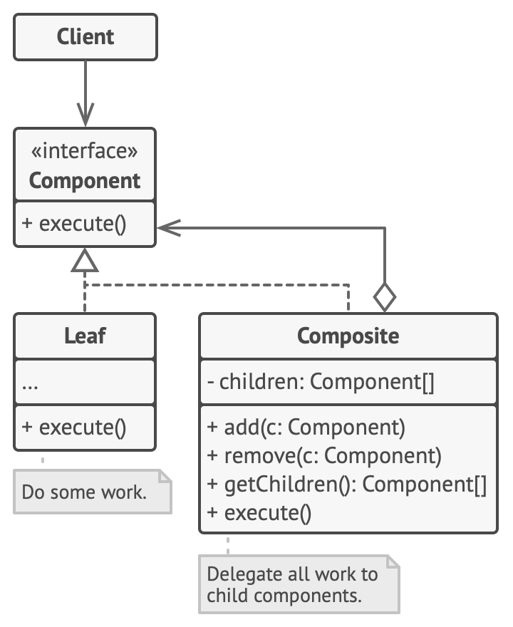
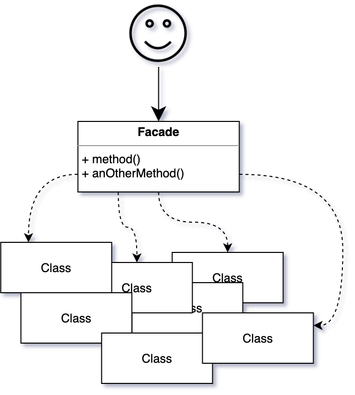
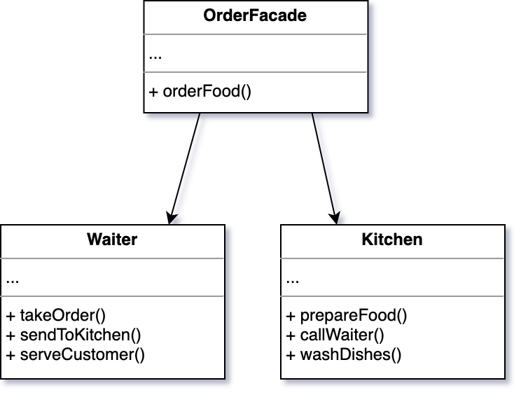
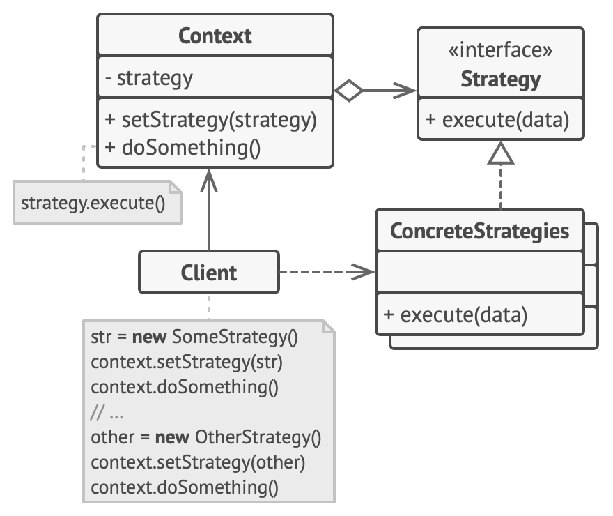

# <!--fit--> Design Patterns
<h3 class="text-right">par eliot demots</h3>

---

<!-- paginate: true -->

## À propos

**Eliot**

ESGI IW 2021

Développeur web fullstack

Wizards Technologies

PHP / React

---

<!-- paginate: true -->

## <!-- fit -->Et vous ?

---

<!-- paginate: true -->

## Test de positionnement

---

## Sommaire

### 1 - Principes de conception

### 2 - Design patterns

---

## Principes de conception

> Méthodologie pour concevoir un programme

### S.O.L.I.D

### D.R.Y

---

## S.O.L.I.D

> Acronyme des cinqs fondamentaux de la POO

Single responsibility

Open-Closed

Liskov Substitution

Interface segragation

Dependency inversion

---

## Single responsibility principle (SRP)

> Une classe n'a **qu'une seule responsabilité**

#### Les +

- *Tests* - une classe n'ayant qu'une responsabilité est plus facile à tester
- *Organisation* - des classes plus petites sont plus faciles à rechercher et maintenir 

---

## Open-Closed principle (OCP)

> Une classe est **ouverte à l'extension** mais **fermée à la modification** 

<!-- Exception faite de la correction de bugs dans l'application -->

#### Les +

- *Evolutivité* - on ne modifie pas le code éxistant donc on évite l'ajout de bugs potentiels

---

## Liskov substitution principle (LSP)

> Si une classe B est un sous-type de la classe A, **alors on doit pouvoir remplacer A par B sans perturber le comportement du programme**

---

## Interface segregation principle (ISP)

> Les grandes interfaces doivent être **divisées** en plus petites interfaces.

#### Les +

- *Organisation* - Les classes qui implémentent les interfaces ne se préoccupent que des méthodes qui les intéressent

---

## Dependency inversion principle (DIP)

<!-- Ex: Garage > Voiture / Moto / Vélo => Véhicules -->

> Découplage de modules grâce à des abstractions

#### Les +

- *Fléxibilité* - Permettre une meilleure évolutivité au programme

---

## D.R.Y

> Don't Repeat Yourself

<figure>
<blockquote>
"Chaque élément […] doit avoir une représentation unique, non ambigüe et faisant autorité au sein d'un système."
</blockquote>
<figcaption>
Andy Hunt et Dave Thomas - The Pragmatic Programmer
</figcaption>
</figure>

---

## D.R.Y

> Don't Repeat Yourself

- Vise à réduire la répétition de modèle dans le code et la remplaçant par des **abtractions** ou en la **normalisant** pour *éviter la redondance*

---

## design patterns

> Solutions typiques pour résoudre des problèmes récurrents

<!-- Pas de copier/coller comme pour une fonction ou une librairie qu'on importe -->
- Ressemblent à des plans préétablis pour résoudre un problème de concéption récurrent dans votre code
- C'est un **concept général pour résoudre un problème particulier** 

---

## design patterns

> Ce ne sont pas des algorithmes !

- Les 2 concepts décrivent des solutions typiques à des problèmes connus
- *L'algorithme* définit un ensemble d'actions claires pour atteindre un même résultat
- *Un patron de concéption* appliqué à deux programmes différents **peut être différent**

<!-- Analogie: Recette de cuisine / Plan de maison

Recette: instructions claires qui mènent à un résultat
Plan: Vue d'ensemble du résultat et ses caractéristques, pas d'étapes précises pour y parvenir -->

---

## Catégories de design patterns

Patrons de **création**

Patrons **structurels**

Patrons **comportementaux**

---

## Patrons de création

> Fournissent un mécanisme de création d'objets augmentant la fléxibilité et la réutilisation du code éxistant

---

## Patrons structurels

> Expliquent comment assembler des objets et des classes dans des structures plus grandes, tout en gardant les structures fléxibles et efficaces

---

## Patrons comportementaux

> Assurent une communication efficace et l'attribution des responsabilités entre les objets

---

## <!-- fit --> Patrons de création

---

##  Factory method

<!-- SRP / OCP -->
- **Interface** pour la création d'objets
- **Délègue** aux classes enfant le choix du **type d'objet** à créer

--
#### Use case

Quand on ne connait pas à l'avance les types et dépendances précis des objets.

---

##  Factory method

.png)

---

##  Abstract factory

<!-- SRP / OCP -->

- Permet de créer des familles d'objets sans préciser leur classe concrète

--
#### Use case

Quand on souhaite maniupler les objets d'un même thème si on ne les connaît pas encore ou si on souhaite rendre le code évolutif

---

##  Abstract factory

---

##  Builder

<!-- SRP / OCP -->

- Permet de construire des objets complexes étape par étape

--
#### Use case

Si l'on souhaite **produire différentes variantes** d'un objet en utilisant le **même code**

---

##  Builder

---

##  Singleton

- Créer et fourni une instance qui ne pourra éxister qu'en un seul exemplaire

--
#### Use case

Si l'on souhaite s'assurer qu'une classe n'aura toujours **qu'une seule instance** pour accéder à des ressources partagées - ex: pour se connecter à une base de données, lire un fichier

---

##  Singleton

---

## TP 1

### Creational design patterns

---

## TP 1 (factory method)

- Créez une interface `Book` avec une méthode `getDetails()`.
- Implémentez deux classes concrètes `FictionBook` et
`HistoryBook` qui implémentent cette interface.
- Créez une classe `BookFactory` qui utilise le Factory Method
Pattern pour instancier des objets de classe `Book` en fonction d'un paramètre.

---

## TP 1 (abstract factory)

- Créez une interface `BookFactory` avec des méthodes
`createFictionBook()` et `createHistoryBook()`.
- Implémentez deux classes concrètes `EnglishBookFactory` et
`FrenchBookFactory` qui implémentent cette interface.
- Chacune de ces classes devrait retourner des objets `FictionBook` et `HistoryBook` respectivement.

---

## TP 1 (builder)

- Créez une classe `BookBuilder` qui utilise le design pattern Builder pour construire des objets `Book` étape par étape.
- Utilisez le pattern Builder pour créer un objet `Book` avec divers attributs tels que le titre, l'auteur, 'ISBN, etc.

---

## <!-- fit --> Patrons structurels

---

##  Adapter

<!-- SRP / OCP -->

- Permet de faire collaborer des classes normalement incompatibles qui n'implémente pas les mêmes interfaces.

--
#### Use case

Lorsqu'on souhaite notamment utiliser des librairies externes qui ne sont pas frocèment compatibles avec notre code éxistant

---

##  Adapter

---

##  Composite

<!-- OCP -->

- Agence les objets en **arborescence** pour traiter ces arborescences comme des **objets individuels**.

--
#### Use case

Quand on doit implémenter une arborescence objets

---

##  Composite

---

##  Facade

- Procure une classe donnant un  accès simplifié à n'importe quel ensemble complexe de classes.

---

##  Facade

---

##  Proxy

- Permet de maîtriser l'accès à un objet
- Permet d'éffectuer des actions et/ou manipulations avant ou après que la demande ne lui parvienne.

--
#### Use case

Lorsque qu'on souhaite accèder à des données volumineuses, mais seulement de temps en temps

---

##  Proxy

---

##  Decorator

- Ajoute dynamiquement de nouveaux comportements à des objets.
- "Emballe" notre objets dans des boîtes qui ajoutent ces comportements.

--
#### Use case

Si l'on souhaite ajouter des fonctionnalités cumulables à notre objet.

---

##  Decorator

---

## TP 2

### structual design patterns

---

## TP 2 (Adapter)

- Si ce n'est pas déjà le cas, ajoutez un attribut `price` à votre classe Book et son getter.
- Créez une interface `EBook` avec une méthode `getOnlinePrice()` pour les livres électroniques.
- Implémentez une classe `EBookAdapter` qui adapte la classe `Book` pour la transformer en livre électronique. Cette classe devrait implémenter l'interface `EBook` et utiliser la classe `Book` pour obtenir le prix.

---

## TP 2 (Composite)

- Créez une classe `BookCategory` qui représente une catégorie de livres, telle que "Science-Fiction", "Histoire" ou "Romance".
- Utilisez le pattern **composite** pour permettre l'ajout de livres individuels ou de sous-catégories de livres à une catégorie.
- Implémentez une méthode pour afficher la hiérarchie complète des catégories et des livres.

---

## TP 2 (decorator)

- Créez une classe `DiscountedBook` qui implémente l'interface `Book` et accepte un livre en tant que paramètre dans son constructeur.
- La classe `DiscountedBook` doit réduire le prix du livre original de 10% lors de l'appel à la méthode `getPrice()`.

---

## TP 2 (proxy)

- Ajoutez un attribut `pegi` à vos livres.
- Créez une interface `LibraryInterface` avec une méthode `readBook()`.
- Implémentez une classe `Library` qui implémente cette interface pour permettre la lecture de livres.
- Créez une classe `PegiProxy` qui agit comme un proxy pour `Library`. Le proxy doit vérifier si l'utilisateur a l'âge requis pour lire le livre et appeler la méthode `readBook()` en conséquence.

---

## TP 2.1 (facade)

- Créez une classe abstraite `Librarian` qui utilisera le pattern `Singleton`.
- Faites en sortes que votre `Librarian` contienne un attribut `booksByCategory` représentant les livres de la librairie ordonnés par catégories

---

## TP 2.2 (facade)

- Créez une méthode `getBook()` qui prendra en paramètre un titre, l'âge du client, si le client veut un e-book et si il a le droit à une remise.
- Dans la méthode `getBook()`, 
  + Cherchez le livre grâce à son titre dans la liste créée (`BookCategory`)
  + vérifiez que le client à l'âge requis pour le lire
  + transformez le livre en e-book si nécessaire
  + appliquez une réduction si il y est éligible.

---

## <!-- fit --> Patrons comportementaux

---

##  Observer

<!-- Analogie: Le facteur ne distribue des magazines qu'à ceux qui ont choisi de le recevoir (abonnement Picsou magazine) -->

- Permet de notifier des objets qu'un évènement qu'ils observent a eu lieu

--
#### Use case

Lorsque que vous voulez que la modification de l'état d'un objet en impact d'autres, sans que vous les connaissiez à l'avance et qu'ils puissent changer dynamiquement.

---

##  Observer

---

##  Strategy

<!-- Analogie: Différents moyens de transports pour aller de A à B (vélo: long/peu coûteux; bus: moyennement long/moyennement coûteux; voiture: rapide/coûteux) -->

- Permet de définir des familles d'algorithmes dans des classes différentes et de rendre leurs objets intérchangeables. 

--
#### Use case

Lorsque vous voulez avoir différentes variantes d'un algorithme dans un objet et que vous voulez passer d'un algo à un autre à l'éxécution.

---

##  Strategy

---

##  Command

<!-- Analogie: Le ticket de commande d'un restaurant -->

- Permet de transformer une action en objet contenant les détails de cette action
- Permet de planifier, mettre en file d'attente ou annuler des opérations.

--
#### Use case

- Lorsque qu'on souhaite planifier, mettre en file d'attente, éxécuter à distance ou rendre réversible une action.

---

##  Command

---

##  Chain of responsibility

<!-- Analogie: Un support technique qui vous renvoie à travers plusieurs services avant que vous ne trouviez le bon -->

- Permet de faire circuler une demande parmi une chaîne de "manipulateurs".
- Ces manipulateurs peuvent traiter la demande, la passer au suivant ou couper court à la chaîne.

--
#### Use case

Lorsque que vous voulez effectuer certaines opérations et/ou vérifications sur un objet dans un ordre donné.

---

##  Chain of responsibility

---

## TP 3

### behavioral design patterns

---

## TP 3 (Command)

- Créez une interface `LibraryCommand` avec une méthode `execute()` pour éxécuter des commandes sur les livres.
- Implémentez des classes concrètes à partir de l'interface `LibraryCommand` pour emprunter (`BorrowBookCommand`) et retourner (`ReturnBookCommand`) des livres.

<small>

> (Faites les changements nécessaires dans les classes impactées)

</small>

---

## TP 3 (Chain of responsibility)

- Créez une interface `LibraryHandler` avec une méthode `handleRequest()` pour gérer les demandes de livres.
- Implémentez des classes concrètes de "manipulateurs" qui traitent les demandes en fonction de leur paramètres :
    1. `AvailableBookHandler`
    2. `RequiredAgeBookHandler`

---

## TP 3 (Strategy)

- Créez une interface `BookSortingStrategy` avec une méthode `sort()` pour trier les livres.
- Implémentez des classes concrètes de stratégie pour trier les livres dans leur catégorie selon certains critères :
    1. `TitleSortingStrategy`
    2. `AuthorSortingStrategy`
    3. `PriceSortingStrategy`

---

## TP 3 (Observer)

- Créez une classe `LibraryPublisher` qui informera les abonnés des évènements suivants :
    - `book:added`
    - `book:returned`
- Créez une interface `LibrarySubscriber` avec une méthode `notify()`.
- Implémentez les classes concrète de `LibrarySubscriber` pour notifier (affichez simplement dans la console) les abonnés qu'un évènement a eu lieu.

---

# <!--fit--> Merci !

---

## Une question ?
> ddemots@myges.fr

#### Crédits

- [refactoring.guru](refactoring.guru)

